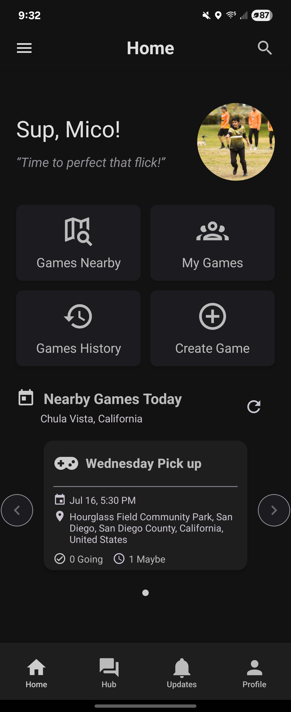
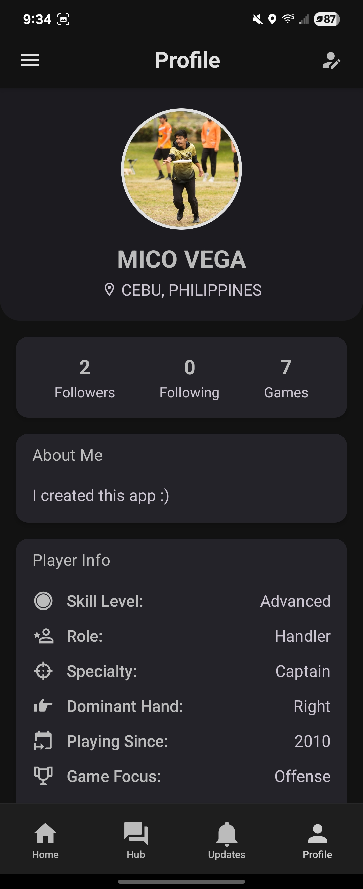
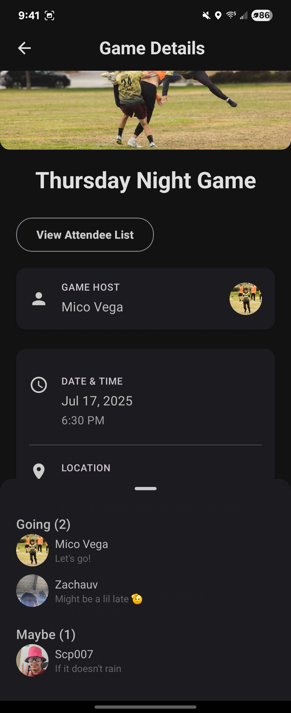
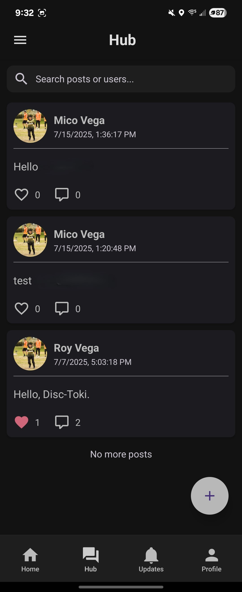

# Disc-Toki — Ultimate Frisbee Pickup Game Finder

## 🚀 Overview
Disc-Toki is a cross-platform mobile app that helps users **discover and join Ultimate Frisbee pickup games**. Features include a home feed, real-time “Games Nearby” discovery, user authentication, player profiles, attendance tracking, and a community hub for events.

## 🛠️ Tech Stack
- **React Native (Expo)**  
- **TypeScript**  
- **Firebase** (Firestore & Authentication)  
- **AI-assisted development** for rapid prototyping, debugging, and optimization

## ✨ Key Features
- Home screen feed & “Games Nearby” discovery (**geolocation-based queries**)  
- User authentication & player profiles  
- Attendance tracking and game creation with **duplicate-entry guards**  
- Community hub for events  
- Firestore queries optimized with **pagination and limits** to reduce read/write costs  

## ⚙️ Technical Highlights
- **Geolocation fetching:** Queries nearby games efficiently using device location  
- **Duplicate prevention:** Guards against multiple signups and game creation
- **Pagination & limits:** Optimized Firestore reads/writes for real-time feeds  
- **AI-assisted development:** Used to optimize query logic, component structure, and debugging  

## 📸 Screenshots *(mock data for clarity)*

  
  
  
  
  

## 🎥 Demo / App Downloads
- [Watch Demo Video](https://drive.google.com/your-demo-video-link)  --
- [Download Android APK](https://drive.google.com/your-apk-link)  ---
- [Download iOS IPA]([https://drive.google.com/your-ipa-link](https://testflight.apple.com/join/WEXMcD4M))  

## 🧩 My Role & Impact
- Designed backend **data structures and Firestore queries**  
- Implemented **authentication and role-based views**  
- Added **geolocation queries, duplicate guards, and pagination**  
- Leveraged AI tools to **optimize functionality** and speed development  
- Focused on backend logic and problem-solving; UI/UX refined iteratively  

## 📌 Status
- Public testing phase — core features fully functional  
- UI/UX mostly polished, with minor refinements ongoing  
- Actively monitoring performance and user feedback for improvements
